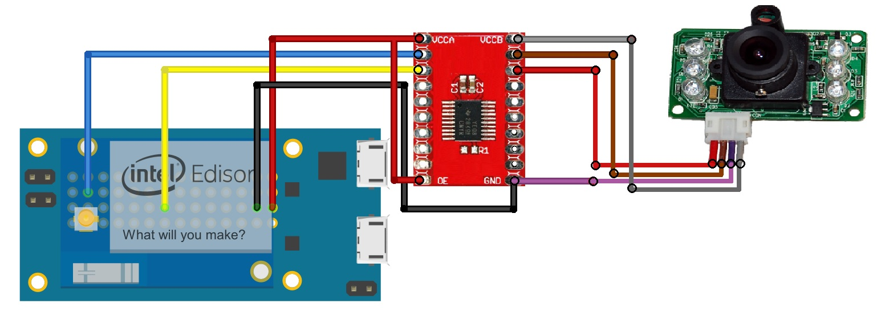

# LinkspriteEdisonIRCamera
Infrared JPEG Color Camera Serial UART TTL Level - Edison Library
 
Index
=================

  * [Updates](#updates)
  * [Coming Next](#coming-next)
  * [Resources](#resources)
   * [C Library](C)
   * [Run Example](C/RUN_EXAMPLE.txt)
   * [Output Images](Images)
  * [Arduino Board Setup](#arduino-board-setup)
  * [Mini-Breakout Board Setup](#mini-breakout-board-setup)
  * [Compilation](#compilation)
  * [Execution](#execution)
  * [LICENSE](#license)

Updates
============

 - Now you activate and deactivate the Power Saving Mode
 - Now you can Change the BAUD of the camara; it does not increase the performance significantly, but it is available and may be useful
 - Now you can Connect your Camera directly to the Edison mini-breakout board without the need of the Arduino Board!
 - Now you can Change the compression Ratio 
  - I tried to change the ratio in the range specified by the manufacturer but the camera refuses to do so; anyways the option to change it is there altough the camera will just ignore it.
 - Check out the RUN_EXAMPLE.txt so you can take a look at what you should be seeing when you run the **main.c** sample code
 - Now you can get the 3 available resolutions 640x480, 320x240 and 160x120
 - Now you can export the content to a buffer or directly to a jpeg file
 - You can print your buffer to a jpeg file
 - I will soon explain the Returns of the functions; in simple words, if you get a 0 return, everything's fine. I will add this information soon.
 
[Back to Top](#index)

Coming Next
============

### There will be some extra modifications and documentation
 - MCU Library
 
[Back to Top](#index)

Resources
============

 - Infrared JPEG Color Camera Serial UART TTL Level [Web Page](http://store.linksprite.com/infrared-jpeg-color-camera-serial-uart-ttl-level/)
 - Infrared JPEG Color Camera Serial UART TTL Level [User Manual ](http://www.linksprite.com/upload/file/1291522825.pdf)
 - [C Library](C)
 
[Back to Top](#index)

Arduino Board Setup
============
In order to make this code work with your Arduino Breakout Board, you will need to consider several steps:
 - Even though you will use your Arduino Board, you will program it using the Linux Terminal
- The easy way to activate the Serial Port to communicate with the camera is running this Arduino Sketch:
```sh
void setup() 
{  
       Serial1.begin(38400); 
}  
void loop() 
{  
       delay(1000);      
}  
```
 - Add the **C Folder** files to a directory of your preference within the Edison (Yocto)
 - Between the RX and TX of your camera and the Arduino's connect a 10K resistor
 - Power your Camera with a separate Power Source since the Arduino Breakout Limits the Current
 - You can power it with your computer using a normal USB cable
 - Cut the USB Cable and you will see 4 cables (you will only use the Red and Black)
  - Be carefull not to connect the other 2 cables
 - Connect the RedUSB cable to the 5V pin of the camera
 - Connect the BlackUSB cable to the Ground pin of the camera and to the Arduino Ground

 
[Back to Top](#index)

Mini-Breakout Board Setup
============
In order to make this code work with your Mini-Breakout Board, you will need to consider several steps:
- You need to keep in mind that you MUST use a Level Shifter. The one that I used was: [Texas Instruments TXB0108 8-Bit Bidirectional Voltage-Level Translator](http://www.ti.com/lit/ds/symlink/txb0108.pdf)
- The easy way to activate the Serial Port to communicate with the camera is running this Arduino Sketch (This only needs to be run once! It will get rid of the extra **end-of-line** character sent from the camera to the Edison. After the reboot it should keep its configuration)
```sh
void setup() 
{  
       Serial1.begin(38400); 
}  
void loop() 
{  
       delay(1000);      
}  
```
 - Add the **C Folder** files to a directory of your preference within the Edison (Yocto)
 - Make sure you follow these connections (The IC shows a Level shifter; it supposes that you have the right Capacitors and Resistors connected to make it work properly)
 
 - Here is one example of the [level shifter](https://hetpro-store.com/convertidor-de-niveles-logicos-bidireccional-level-shifter-8ch/) used for this tutorial
 
[Back to Top](#index)

Compilation
============
Compile the code as follows:

```sh
 gcc main.c -o main.out
```
 
[Back to Top](#index)

Execution
============
Execute your file:

```sh
 chmod +x main.out
 ./main.out
```
 - You will see that this **main** will output 6 fotos, the first one of each pair is created by printing the array that contains the photo, and the second one by printing directly to the file with no user-created array

[Back to Top](#index)


LICENSE
=================

Copyright (c) 2014, Intel Corporation

Redistribution and use in source and binary forms, with or without modification,
are permitted provided that the following conditions are met:

* Redistributions of source code must retain the above copyright notice,
  this list of conditions and the following disclaimer.
* Redistributions in binary form must reproduce the above copyright notice,
  this list of conditions and the following disclaimer in the documentation
  and/or other materials provided with the distribution.
* Neither the name of Intel Corporation nor the names of its contributors
  may be used to endorse or promote products derived from this software
  without specific prior written permission.

THIS SOFTWARE IS PROVIDED BY THE COPYRIGHT HOLDERS AND CONTRIBUTORS "AS IS" AND
ANY EXPRESS OR IMPLIED WARRANTIES, INCLUDING, BUT NOT LIMITED TO, THE IMPLIED
WARRANTIES OF MERCHANTABILITY AND FITNESS FOR A PARTICULAR PURPOSE ARE
DISCLAIMED. IN NO EVENT SHALL THE COPYRIGHT OWNER OR CONTRIBUTORS BE LIABLE FOR
ANY DIRECT, INDIRECT, INCIDENTAL, SPECIAL, EXEMPLARY, OR CONSEQUENTIAL DAMAGES
(INCLUDING, BUT NOT LIMITED TO, PROCUREMENT OF SUBSTITUTE GOODS OR SERVICES;
LOSS OF USE, DATA, OR PROFITS; OR BUSINESS INTERRUPTION) HOWEVER CAUSED AND ON
ANY THEORY OF LIABILITY, WHETHER IN CONTRACT, STRICT LIABILITY, OR TORT
(INCLUDING NEGLIGENCE OR OTHERWISE) ARISING IN ANY WAY OUT OF THE USE OF THIS
SOFTWARE, EVEN IF ADVISED OF THE POSSIBILITY OF SUCH DAMAGE.

[Back to Top](#index)